# Retail Microservices Platform on AWS EKS

[](https://github.com/ngems1/microservice/actions/workflows/deploy.yml)
[](https://github.com/ngems1/microservice/actions/workflows/ci.yml)
[](https://github.com/ngems1/microservice/actions/workflows/infra.yml)
[](https://github.com/ngems1/microservice/actions/workflows/codeql.yml)

An online shop made of **12 microservices** running on **Amazon EKS**, with separate **dev** and
**prod** environments, an **event-driven order flow** (EventBridge, SQS, Lambda), real order emails
(Amazon SES), autoscaling, Prometheus + Grafana, and a GitHub Actions pipeline that signs in to AWS
with **OIDC** (no stored keys). Based on Google's Online Boutique, extended with an inventory
service, managed AWS data stores and the order events.

| Environment | Address |
|---|---|
| prod | `https://shop.sebngembou-cloud.click` |
| dev | `https://dev.sebngembou-cloud.click` |
| Grafana | `https://grafana.sebngembou-cloud.click` (allow-listed IPs only) |

> The infrastructure is destroyed at the end of every day to save cost, so these addresses only
> answer while it is up.

---

## Highlights

- **12 polyglot microservices** — Go, C#, Java, Node.js and Python, talking gRPC, packaged in one
  Helm chart with values per environment.
- **Two environments, one cluster** — `boutique-dev` and `boutique-prod` share one EKS cluster but
  are kept apart by namespaces, deny-all NetworkPolicies, per-environment IAM roles (Pod Identity
  with a namespace condition), and their own databases, queues, event bus and KMS key. An
  **isolation test** proves it after every prod deploy.
- **Managed data layer** — RDS MySQL 8.4 (orders and catalog; prod Multi-AZ, TLS verified),
  ElastiCache Redis (cart and a catalog cache), DynamoDB (stock and the email log).
- **Event-driven orders** — checkout publishes `OrderCreated`; inventory reserves stock; a Lambda
  updates the order; emailservice sends the email. One SQS queue and dead-letter queue per
  consumer, idempotent consumers, alarms to Slack.
- **Real notifications** — order emails through **Amazon SES** from `orders@sebngembou-cloud.click`
  (DKIM, IAM limited to that sender), and a Slack message per order.
- **HTTPS on a real domain** — Route 53 + ACM wildcard certificate, TLS 1.2+ policy, HTTP redirected
  to HTTPS; the smoke test checks the certificate on the real name.
- **Autoscaling** — HorizontalPodAutoscalers on the five busiest services, metrics-server, and VPC
  CNI prefix delegation (110 pods per node instead of 17).
- **SAST with CodeQL** — every pull request is analysed for security bugs in all 5 languages
  (Go, C#, Java, JavaScript, Python) and in the GitHub workflows; results in the Security tab.
- **Secure CI/CD** — OIDC roles (read-only for pull requests, deploy only from `main`), Checkov on
  Terraform, immutable images tagged with the commit SHA, an **ECR scan gate** before anything
  reaches the cluster, and prod behind an approval.
- **Safe deployments** — database migrations as a Job inside the VPC, `helm --rollback-on-failure`,
  HTTPS smoke tests with automatic rollback, and a one-click redeploy of any previous release.
- **Observability** — Prometheus + Grafana (Prometheus and CloudWatch data sources, SLI dashboard),
  Container Insights logs, CloudWatch alarms to Slack, pipeline events to Slack.
- **Proven under failure** — stress tests, chaos tests (pod and consumer failures) and a rollback
  demo, with results below.

---

## Architecture

**In plain words**

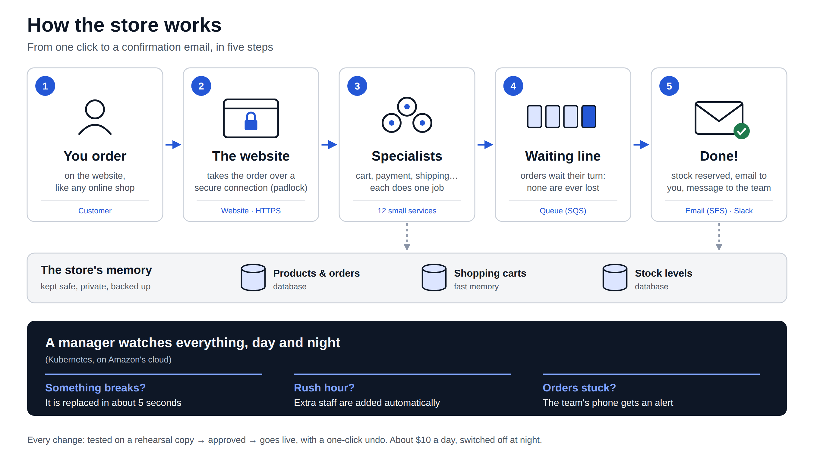

**In detail**

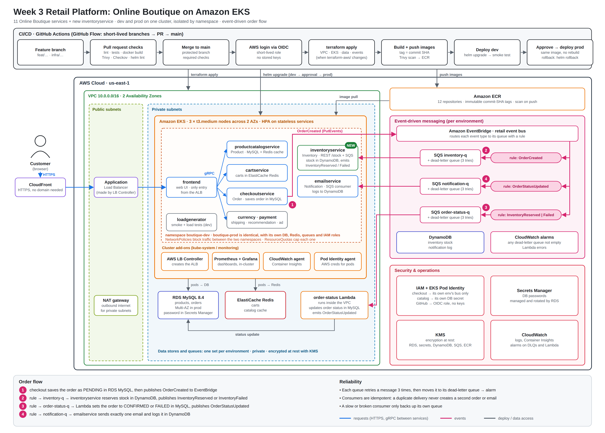

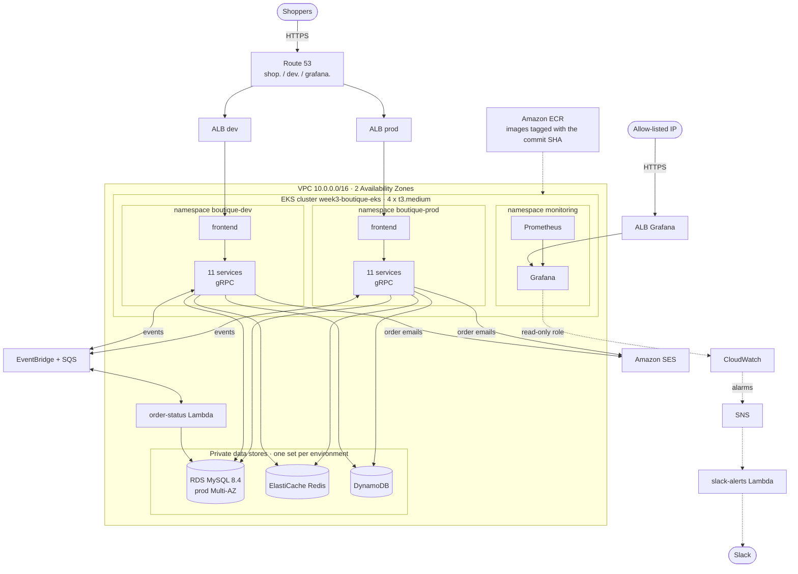

### The 12 services

| Service | Language | Role |
|---|---|---|
| frontend | Go | Web UI, the only public service (behind the ALB) |
| productcatalogservice | Go | Products from MySQL, cached in Redis |
| cartservice | C# | Shopping cart in Redis |
| checkoutservice | Go | Places the order, publishes `OrderCreated` |
| inventoryservice | Python | Reserves stock in DynamoDB (new service) |
| emailservice | Python | Order emails (SES) and Slack messages |
| currencyservice | Node.js | Currency conversion |
| paymentservice | Node.js | Fake card payment |
| shippingservice | Go | Shipping quotes |
| recommendationservice | Python | Product suggestions |
| adservice | Java | Text ads |
| loadgenerator | Python (Locust) | Simulated shoppers for load and stress tests |

### Order flow

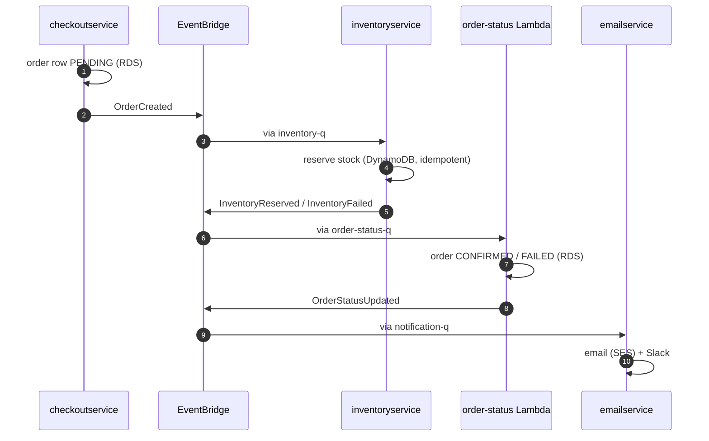

Each queue has a dead-letter queue (after 3 failed tries) and two alarms (DLQ not empty; oldest
message older than 5 minutes) that post to Slack `#boutique-alerts`.

### Dev / prod isolation

| Layer | How |
|---|---|
| Namespaces | `boutique-dev`, `boutique-prod` |
| Network | Deny-all NetworkPolicy + one policy per service; prod only accepts callers from `boutique-prod` |
| AWS permissions | One Pod Identity role per service per environment, with a namespace condition |
| Data | Separate RDS, Redis, DynamoDB tables, queues, event bus and KMS key |
| Entry point | One ALB and one hostname per environment |

Details and the test: [docs/week3/ISOLATION.md](docs/week3/ISOLATION.md).

---

## Tech stack

| Area | Tools |
|---|---|
| Services | Go, C# (.NET), Java, Node.js, Python; gRPC + Protocol Buffers |
| Kubernetes | Amazon EKS 1.35, Helm, AWS Load Balancer Controller, metrics-server, HPA, VPC CNI NetworkPolicies, EKS Pod Identity |
| Data | RDS MySQL 8.4, ElastiCache Redis 7.1, DynamoDB |
| Events | EventBridge, SQS (with DLQs), Lambda |
| Infrastructure | Terraform (VPC, EKS, ECR, RDS, ElastiCache, DynamoDB, EventBridge, SQS, Lambda, KMS, IAM, Route 53, ACM, SES, CloudWatch, SNS) |
| CI/CD | GitHub Actions with OIDC, GitHub Environments for prod approval, GitHub Flow with a ruleset on `main` |
| Observability | Prometheus, Grafana, CloudWatch Container Insights, CloudWatch alarms |
| Notifications | Slack incoming webhooks (deploys, alerts, orders), Amazon SES |
| Security scanning | CodeQL SAST (all 5 languages + workflows), Checkov (Terraform), ECR scan on push (blocking on CRITICAL) |
| Testing | Python unittest, Helm lint/render, Locust, chaos and isolation scripts |

---

## Repository layout

```
.
├── src/                   12 services + loadgenerator (one Dockerfile each)
├── protos/                gRPC definitions
├── helm-chart/
│   ├── templates/         one file per service, ingress, HPA, NetworkPolicies
│   ├── values.yaml        defaults (local)
│   ├── values-aws.yaml    EKS: service accounts, ALB ingress, autoscaling
│   └── values-dev.yaml, values-prod.yaml
├── terraform-bootstrap/   state bucket + GitHub OIDC roles (one-time)
├── terraform-aws/
│   ├── network.tf, eks.tf, ecr.tf, dns.tf, ses.tf, slack.tf, monitoring.tf
│   ├── lambda/            order_status, slack_alerts
│   └── modules/environment/   everything one environment owns (data, events, IAM)
├── db/migrations/         MySQL schema and seed data
├── deploy/                scripts run by the workflows: smoke, isolation, chaos,
│                          load test, order-flow, diagnose, DNS records
├── monitoring/            kube-prometheus-stack values, Grafana dashboards
├── docs/week3/            guides, runbook, security notes, architecture diagram
├── docker-compose.yml     local stack with Redis, MySQL and DynamoDB Local
└── .github/
    ├── workflows/         CI, infra, deploy and operations workflows
    ├── CODEOWNERS
    └── pull_request_template.md
```

---

## Run it locally

Requires Docker Desktop (6 GB memory).

```powershell
docker compose up --build -d
docker compose ps
```

- Shop: <http://localhost:8080>
- Stock: <http://localhost:8081/stock>
- MySQL: `127.0.0.1:3306` (user `boutique`)

The first build takes 20 to 40 minutes (12 images). Full guide, including Docker Desktop
Kubernetes with the same Helm chart: [docs/week3/LOCAL.md](docs/week3/LOCAL.md).

---

## CI/CD pipeline

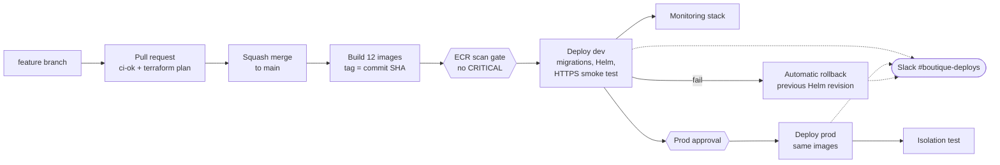

| Workflow | When | What it does |
|---|---|---|
| `ci.yml` | Every pull request | Unit tests (inventory, emailservice, Lambda), Helm lint and render (must contain the HPAs), Docker build of changed services → the `ci-ok` check |
| `codeql.yml` | Every pull request, push to `main`, weekly | SAST: CodeQL analyses the Go, C#, Java, JavaScript and Python code and the workflows; results in the Security tab |
| `infra.yml` | PR (plan, read-only role), merge to `main` (apply), manual (`plan` / `apply` / `destroy`) | Terraform + Checkov |
| `deploy.yml` | Push to `main` touching app code, or manual | Builds and scans, deploys dev, then prod after approval, then monitoring and the isolation test |
| `deploy-env.yml` | Called by `deploy.yml` | One environment: Load Balancer Controller, DB migrations, Helm, DNS, smoke test, rollback |
| `cluster-status.yml` | Manual | Pods, events, autoscalers, restarts, Helm history, CloudWatch checks, per namespace |
| `order-flow.yml` | Manual | Follows orders through RDS, DynamoDB, queues, Lambda and SES |
| `load-test.yml` | Manual | Locust `load` (demo) or stepped `stress` test in dev, with stock reset |
| `chaos.yml` | Manual | `pod-failure` or `consumer-failure` in dev; everything restored at the end |
| `catalog.yml` | Manual | Changes a price in MySQL to show the Redis cache at work |
| `isolation-test.yml` | After prod, or manual | Proves dev can't reach prod (network and IAM) |
| `bootstrap.yml` | Once | State bucket and the plan/deploy roles |

**Releases are immutable:** every image is tagged with the commit SHA (ECR tags can't be
overwritten), the shop footer shows that SHA as **Version**, and prod gets exactly the images that
passed in dev.

### Branching strategy (GitHub Flow)

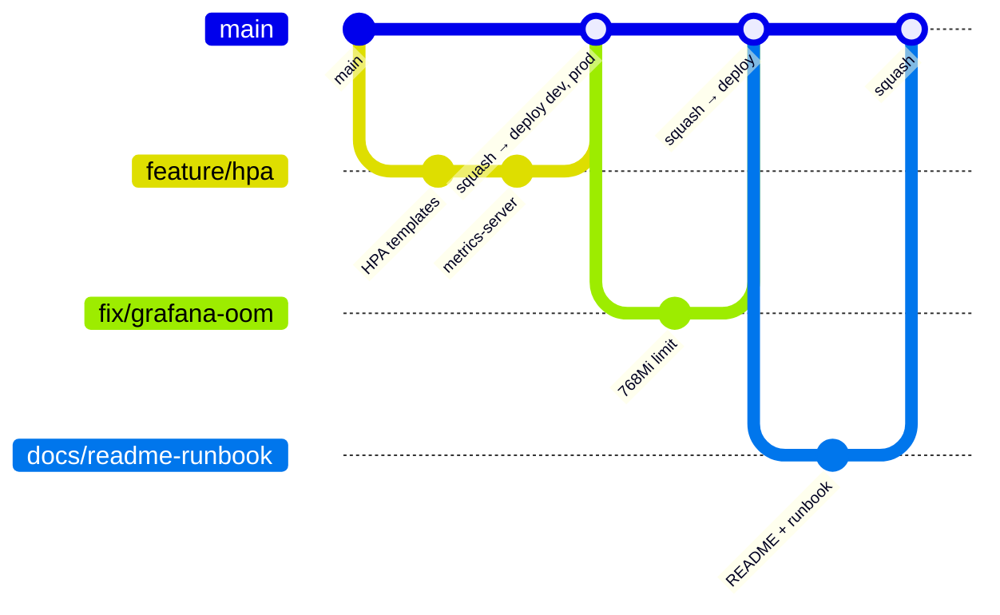

- `main` is always deployable and protected by a ruleset: pull request required, `ci-ok` must pass,
  linear history, no force pushes, no deletion.
- Short-lived branches: `feature/`, `fix/`, `infra/`, `docs/`, `chore/`. One pull request each,
  squash-merged.
- Branches are never deployed. The deploy role only trusts `main`; pull requests only get the
  read-only plan role.

```powershell
git switch main; git pull
git switch -c feature/short-name
# edit, then:
git add -A; git commit -m "Describe the change"
git push -u origin feature/short-name
```

On GitHub: **Compare & pull request** → wait for `ci-ok` → **Squash and merge**. The merge deploys
dev; prod waits for approval. See [docs/week3/GITHUB-FLOW.md](docs/week3/GITHUB-FLOW.md).

---

## Deploying to AWS

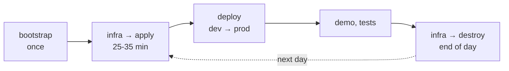

1. **One-time AWS setup** — GitHub OIDC provider and the bootstrap role, then the `bootstrap`
   workflow: [docs/week3/BOOTSTRAP.md](docs/week3/BOOTSTRAP.md).
2. **GitHub settings** — environments `dev` and `prod` (required reviewer), variables and secrets:

   | Kind | Names |
   |---|---|
   | Repository variables | `AWS_REGION`, `AWS_PLAN_ROLE_ARN`, `AWS_DEPLOY_ROLE_ARN`, `TF_STATE_BUCKET`, `ADMIN_PRINCIPAL_ARN`, `DOMAIN_NAME`, `SES_RECIPIENTS`, `MONITORING_ALLOWED_CIDR`, optional `SCAN_BLOCKING` |
   | `prod` environment variable | `AWS_BOOTSTRAP_ROLE_ARN` |
   | Secrets (all optional) | `GRAFANA_ADMIN_PASSWORD`, `SLACK_WEBHOOK_URL`, `SLACK_ALERTS_WEBHOOK_URL`, `SLACK_ORDERS_WEBHOOK_URL` |

3. **Infrastructure** — Actions → **infra** → `apply`.
4. **Deploy** — Actions → **deploy** (or merge a pull request). The shop and Grafana addresses are on
   the run's Summary page and in Slack.
5. **Tear down** — Actions → **infra** → `destroy` at the end of the day.

Full guides: [SETUP.md](docs/week3/SETUP.md) and [DEPLOY.md](docs/week3/DEPLOY.md).

**Rollback:** automatic when the pods don't become ready (Helm) or the smoke test fails (previous
revision). By hand: Actions → **deploy** → Run workflow with `image_tag` = an earlier commit SHA.
Nothing is rebuilt.

> **Cost:** about 9 to 12 USD per day while it runs (EKS control plane, 4 nodes, NAT gateway, two
> MySQL databases, two Redis nodes, ALBs, logs). `destroy` removes all of it, including the DNS
> records and the images in ECR.

---

## Security

Full notes: [docs/week3/SECURITY.md](docs/week3/SECURITY.md).

- **No long-lived AWS keys** — GitHub Actions uses OIDC. Pull requests get a read-only role; the
  deploy role only trusts `main` and the `dev` / `prod` environments.
- **Least privilege at runtime** — one EKS Pod Identity role per service and environment, limited
  to that environment's resources and namespace; emailservice may only send as
  `orders@<domain>`; Grafana's role is read-only.
- **Private by default** — only the ALBs are public. Nodes, RDS, Redis and the Lambda live in
  private subnets. Grafana only answers allow-listed IPs (`0.0.0.0/0` is refused by the pipeline).
- **Network policies** — deny-all by default, one allow rule per service call.
- **Encryption** — a KMS key per environment for RDS and its secret; DynamoDB and SQS encrypted at
  rest; TLS to the database with certificate checks; HTTPS on every public address.
- **Secrets stay out of code** — RDS passwords managed by RDS in Secrets Manager; Slack webhooks only
  in GitHub secrets (and Secrets Manager for the alerts Lambda); never in Terraform or the repo.
- **Supply chain** — CodeQL static analysis (SAST) of the application code on every pull request,
  immutable image tags, ECR scan gate on CRITICAL findings, Checkov on every
  Terraform change. ECR's scanner replaced a third-party scanner action after the Trivy GitHub
  Actions compromise (March 2026), so no extra code runs with AWS credentials.
- **Hardened containers** — non-root users and read-only root filesystems.

## Observability

- **Grafana dashboard "Boutique: platform overview"** — SLIs (availability, p95 latency, order
  success, pods not ready), shop traffic, application metrics (cache hit rate, orders reserved /
  failed), event flow (queues, DLQs), Kubernetes CPU / memory / restarts, databases.
- **Prometheus** scrapes pods, nodes and the services' `/metrics`.
- **CloudWatch** — Container Insights logs, ALB / SQS / RDS metrics, alarms per environment.
- **Slack** — `#boutique-deploys` (pipeline), `#boutique-alerts` (alarms), `#boutique-orders`
  (every confirmed / failed order).

Details: [docs/week3/MONITORING.md](docs/week3/MONITORING.md), [docs/week3/SLACK.md](docs/week3/SLACK.md).

---

## Proven results

| Test | How | Result |
|---|---|---|
| Stress test, no autoscaling | load-test `stress`, 800 shoppers, 15 min | 0 errors, ~130 req/s, p95 ~8 s: frontend pinned at its CPU limit |
| Stress test, with HPA | Same test | Home page about 10× faster; next bottleneck found: recommendationservice and sticky gRPC connections |
| Rollback (acceptance step 12) | deploy with an older `image_tag` | Footer and Helm history back on the old version, nothing rebuilt |
| Pod failure | chaos `pod-failure`, checkoutservice | New pod Ready in 5 s, 0 failed shop requests |
| Consumer failure | chaos `consumer-failure`, 8 min | Backlog alarm 🔴 then 🟢 in Slack, queued orders processed after the restart, DLQs at 0 |
| Isolation | isolation-test | dev → prod services BLOCKED; dev role → prod DynamoDB AccessDenied |
| Order email | Checkout with a verified address | SES email "Your order … is confirmed" + Slack message |

---

## Screenshots

### The shop and an order, end to end

<table>
<tr>
<td width="50%">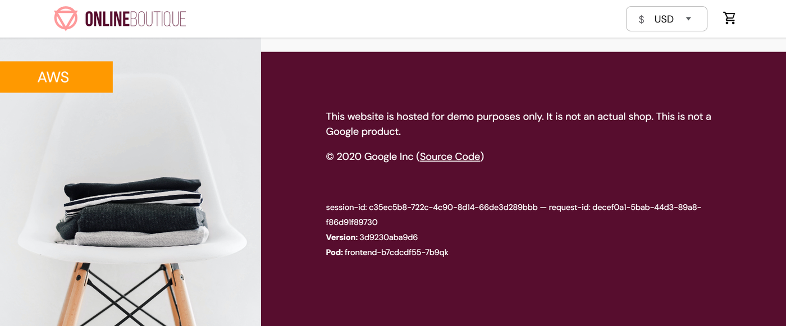<br><sub>The shop, with the release (commit SHA) in the footer</sub></td>
<td width="50%">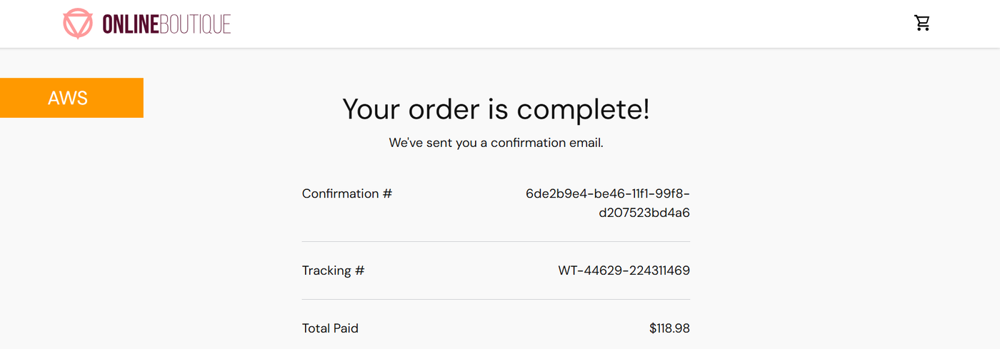<br><sub>Checkout: the order is placed</sub></td>
</tr>
<tr>
<td>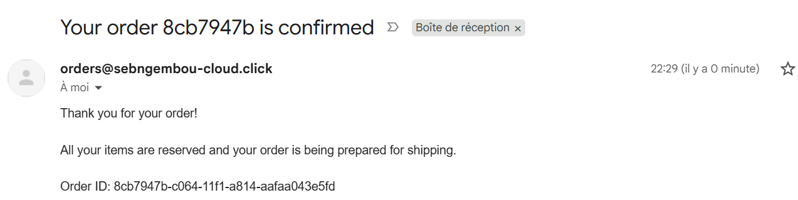<br><sub>Real confirmation email sent by Amazon SES</sub></td>
<td><br><sub>Same order in Slack <code>#boutique-orders</code></sub></td>
</tr>
<tr>
<td colspan="2">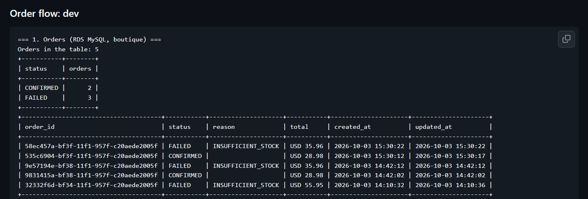<br><sub><code>order-flow</code> workflow: orders in RDS move from PENDING to CONFIRMED, or FAILED when stock runs out</sub></td>
</tr>
</table>

### Pipeline

<table>
<tr>
<td colspan="2">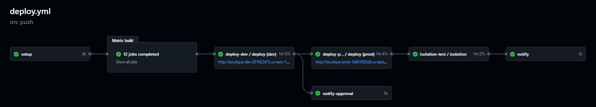<br><sub><code>deploy.yml</code>: 12 builds → dev → approval → prod → isolation test</sub></td>
</tr>
<tr>
<td colspan="2">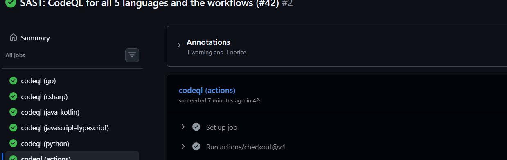<br><sub><code>codeql.yml</code>: SAST on all 5 languages and the workflows, all green</sub></td>
</tr>
<tr>
<td colspan="2">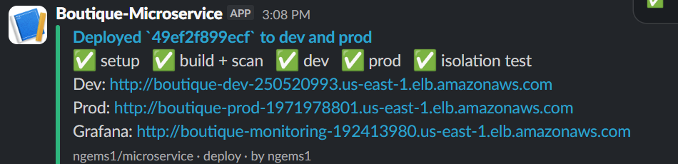<br><sub>The result posted to Slack <code>#boutique-deploys</code></sub></td>
</tr>
</table>

### Monitoring and failure tests

<table>
<tr>
<td width="50%">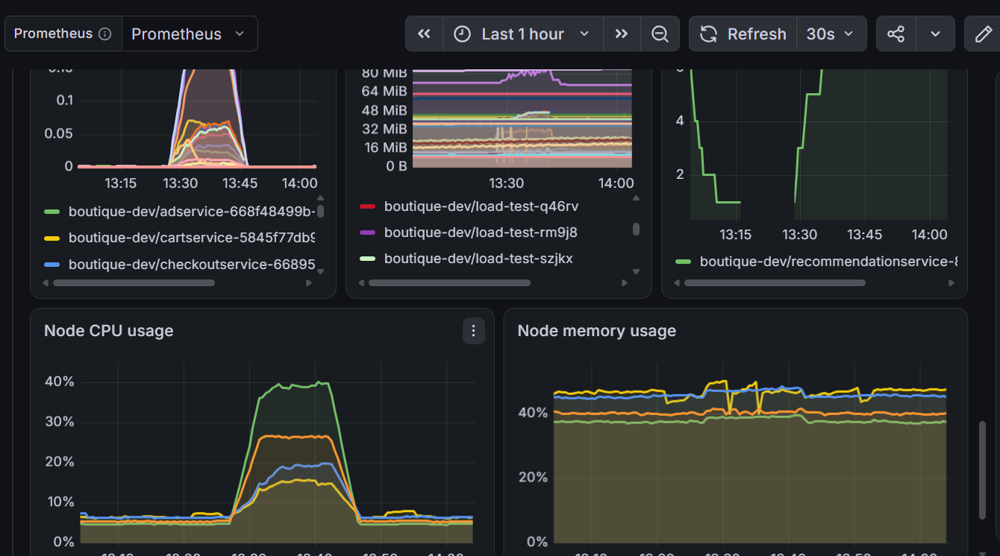<br><sub>Grafana during a load test: pod and node CPU rise, then settle</sub></td>
<td width="50%">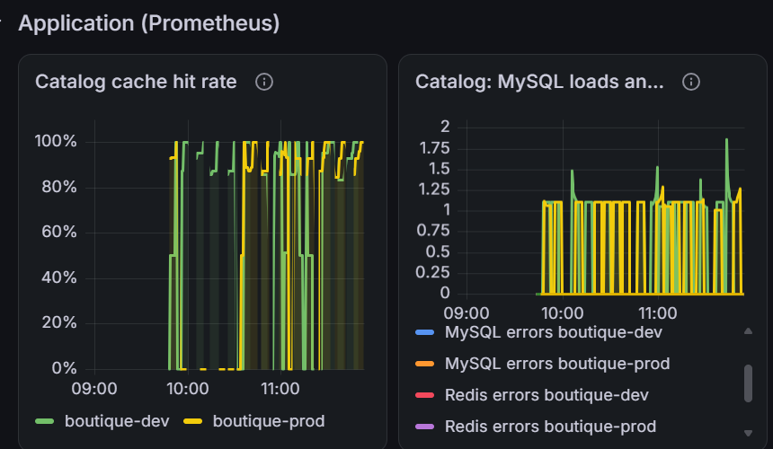<br><sub>Application metrics: catalog cache hit rate, MySQL loads</sub></td>
</tr>
<tr>
<td>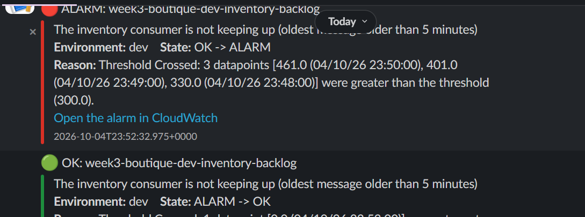<br><sub>Chaos <code>consumer-failure</code>: backlog alarm red, then green, in <code>#boutique-alerts</code></sub></td>
<td>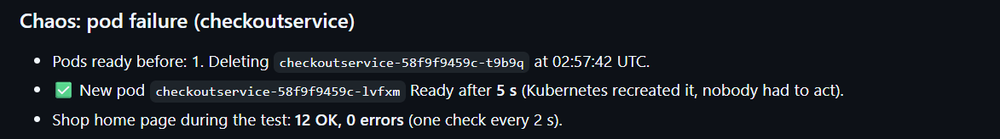<br><sub>Chaos <code>pod-failure</code>: new pod Ready in 5 s, 0 failed requests</sub></td>
</tr>
</table>

---

## Documentation

| Document | Contents |
|---|---|
| [docs/week3/SETUP.md](docs/week3/SETUP.md) | From zero to a running cluster |
| [docs/week3/BOOTSTRAP.md](docs/week3/BOOTSTRAP.md) | Connect GitHub to AWS with OIDC (one-time) |
| [docs/week3/DEPLOY.md](docs/week3/DEPLOY.md) | Pipeline, HTTPS, SES, autoscaling, rollback, chaos, order flow |
| [docs/week3/LOCAL.md](docs/week3/LOCAL.md) | Docker Compose and Docker Desktop Kubernetes |
| [docs/week3/GITHUB-FLOW.md](docs/week3/GITHUB-FLOW.md) | Branching strategy and the `main` ruleset |
| [docs/week3/ISOLATION.md](docs/week3/ISOLATION.md) | Dev / prod isolation and its test |
| [docs/week3/MONITORING.md](docs/week3/MONITORING.md) | Prometheus, Grafana, load and stress tests |
| [docs/week3/SLACK.md](docs/week3/SLACK.md) | Slack channels and webhooks |
| [docs/week3/SECURITY.md](docs/week3/SECURITY.md) | Security controls, scan results, known gaps |
| [docs/week3/RUNBOOK.md](docs/week3/RUNBOOK.md) | Failed deploys, unhealthy pods, database, stuck queues, incident log |

---

## Recent improvements

| Area | Change |
|---|---|
| Security | SAST with CodeQL on every pull request, push to `main` and weekly (all 5 languages + workflows) |
| Notifications | Order emails with Amazon SES (DKIM, sender-restricted IAM) and Slack `#boutique-orders` |
| Network | HTTPS on `sebngembou-cloud.click` for dev, prod and Grafana (Route 53, ACM, HTTP→HTTPS) |
| Reliability | Chaos workflow: pod failure and consumer failure in dev, state restored automatically |
| Deployments | Shop footer shows the release (commit SHA); Helm history in cluster-status |
| Scaling | HorizontalPodAutoscalers, metrics-server, VPC CNI prefix delegation (110 pods per node) |
| Reliability | Higher CPU limits and tolerant health checks after the first stress test |
| Monitoring | Grafana CloudWatch data source (ALB, SQS, RDS, logs) through a read-only role; Grafana memory 768Mi |
| Monitoring | Grafana bundled-plugin fix (`preinstall_disabled`) for the read-only filesystem |
| Workflow | Ruleset on `main`: pull request + `ci-ok` required, linear history, no force pushes |

---

## Author

**Sebastien Ngembou** — [github.com/ngems1](https://github.com/ngems1)
