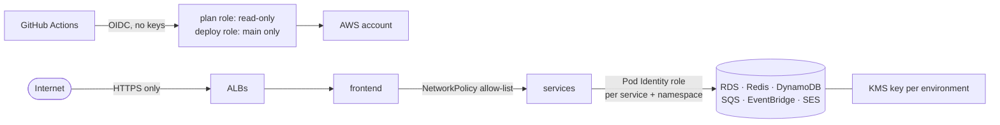

# Security notes

How the platform is protected, layer by layer, and what is still open.

## 1. Pipeline identity (no stored keys)

| Control | Where |
|---|---|
| GitHub signs in with **OIDC**; no AWS access keys exist anywhere | `terraform-bootstrap/`, [BOOTSTRAP.md](BOOTSTRAP.md) |
| `week3-gha-plan`: read-only + state lock, the only role a pull request can get | `terraform-bootstrap/` |
| `week3-gha-deploy`: trusts only `main` and the `dev` / `prod` environments | `terraform-bootstrap/` |
| `week3-bootstrap`: only usable from the protected `prod` environment | [BOOTSTRAP.md](BOOTSTRAP.md) |
| Prod deploys wait for a reviewer (`prod` environment) | GitHub Environments |
| `main` protected by a ruleset: PR + `ci-ok` required, no force push, no deletion | [GITHUB-FLOW.md](GITHUB-FLOW.md) |

Consequence: a branch, a fork or a pull request can only **read** AWS. Changing anything needs a
merge to `main`.

## 2. Least privilege at runtime

- **EKS Pod Identity**: one IAM role per service per environment
  (`terraform-aws/modules/environment/pod-identity.tf`). Each role only names that environment's
  table, queue, bus or secret, and carries a condition on the pod's namespace tag (ABAC), so a dev
  pod can't use a prod role even by mistake.
- **emailservice → SES**: `ses:SendEmail` only, with the condition
  `ses:FromAddress = orders@<domain>`. It can't send as anyone else.
- **Grafana**: read-only CloudWatch and logs role, logs limited to the project's log groups
  (`terraform-aws/monitoring.tf`).
- **order-status Lambda**: its own role, its queue, its event bus, and `kms:Decrypt` on its key.
- **Company IAM restrictions respected**: the personal IAM user has no SES console or role-creation
  rights outside the allowed prefix; checks that need those (SES status, CloudWatch queries) run in
  workflows with the deploy role instead of bypassing the policy.

## 3. Network

| Control | Detail |
|---|---|
| Public surface | Only the three ALBs (dev, prod, Grafana) |
| Private subnets | EKS nodes, RDS, ElastiCache, Lambda: no public IP, outbound through one NAT gateway |
| RDS / Redis security groups | Port 3306 / 6379 from inside the VPC only |
| NetworkPolicies | Deny-all in each namespace + one allow rule per service call; prod accepts callers only from `boutique-prod`. Enforced by the VPC CNI |
| Grafana | ALB restricted to `MONITORING_ALLOWED_CIDR`; the pipeline refuses `0.0.0.0/0` |
| HTTPS | ACM certificate for `<domain>` and `*.<domain>`, policy `ELBSecurityPolicy-TLS13-1-2-2021-06`, port 80 only redirects |

Proven by the isolation test after every prod deploy ([ISOLATION.md](ISOLATION.md)).

## 4. Data protection

| Store | Encryption | Other |
|---|---|---|
| RDS MySQL | At rest with the environment's KMS key; TLS in transit with certificate verification | Password created and rotated by RDS in Secrets Manager (encrypted with the same key); automated backups; prod Multi-AZ |
| DynamoDB | Server-side encryption | Point-in-time recovery |
| SQS | SQS-managed encryption | DLQs keep failed messages 14 days |
| Migration credentials | Temporary Kubernetes Secret, deleted right after the Job | — |
| Slack webhooks | GitHub secrets; the alerts webhook in Secrets Manager | Never in Terraform, the repo or logs |

## 5. Supply chain

- **Immutable images**: tagged with the commit SHA, ECR `IMMUTABLE` tags, so a tag always means the
  same code and prod runs exactly what passed in dev.
- **ECR scan on push** with a **blocking gate**: a CRITICAL finding stops the deploy before the
  cluster (`SCAN_BLOCKING=false` only reports).
- **Why not Trivy**: the Trivy GitHub Action was compromised in March 2026 (CVE-2026-33634). ECR's
  built-in scanner needs no third-party code running with AWS credentials.
- **Checkov** scans `terraform-aws/` on every infra run (soft-fail: results in the run log, reviewed
  here).
- **Pinned base images and dependencies** per service.

## 6. Containers

All services run as **non-root** with a **read-only root filesystem** (`helm-chart/templates/*`),
CPU and memory limits, and liveness / readiness probes. Grafana runs the distroless image with a
read-only disk (`preinstall_disabled` keeps it from trying to write plugins).

## 7. Known gaps (remediation plan)

| Gap | Risk | Fix |
|---|---|---|
| Prod Redis reachable from dev pods, no auth, no TLS | A dev pod could read prod carts | ElastiCache auth token + TLS per environment, token in Secrets Manager |
| No ResourceQuota / LimitRange | A dev load test could starve prod | Quota per namespace, higher PriorityClass for prod |
| No Pod Security Standard label | A privileged pod could be deployed | `pod-security.kubernetes.io/enforce: restricted` on both namespaces |
| EKS API endpoint public | Exposed to the internet (still IAM-authenticated) | Restrict `cluster_endpoint_public_access_cidrs` or go private + runner in the VPC |
| Admin-only cluster access | No per-namespace roles | EKS access entries: edit in dev, view in prod |
| Checkov in soft-fail | Findings don't block | Fix or explicitly skip each finding, then make it blocking |
| No WAF on the ALBs | No managed-rule filtering | AWS WAF with managed rule groups on the prod ALB |
| RDS `deletion_protection = false` | Accidental deletion | Kept off so the daily `destroy` works; turn on for a real prod |
| SES in sandbox | Only verified recipients | Request production access when real customers exist |
